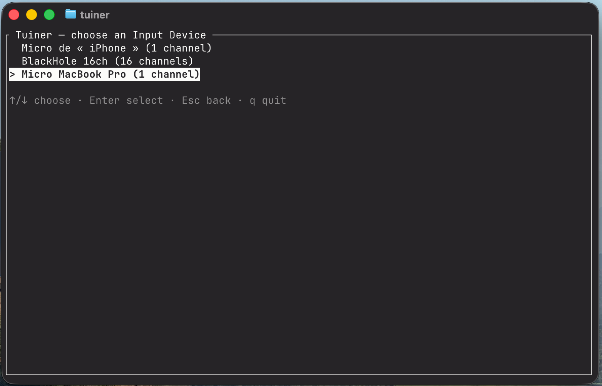
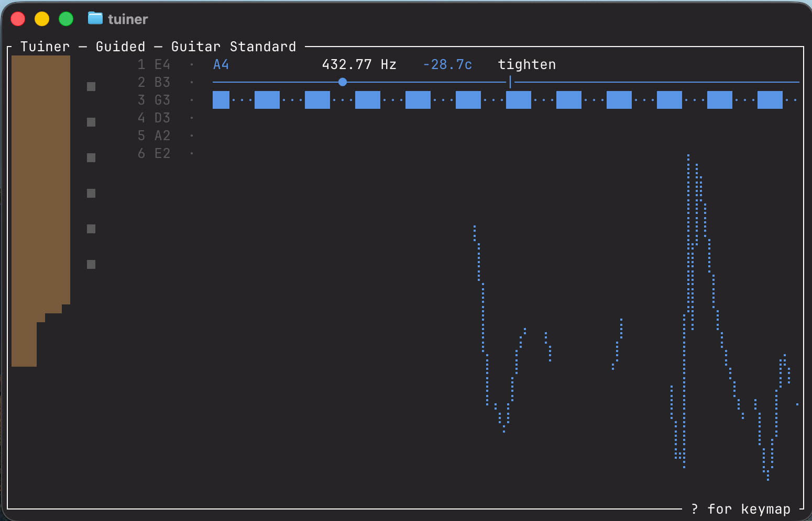

# Tuiner

A terminal instrument tuner for guitar and bass.
If, like me, you are a musician and a nerd, you might find handy to have a simple tuner inside your terminal. Free forever, without ads, just the useful stuff.




It listens to a chosen audio input, works out
what pitch is sounding, and shows which way to turn the peg — with a strobe display precise enough
that a chord rings true afterwards.

## Features

- **Guided Mode**: pick a Tuning (Standard, D Standard, Open C, DADGAD, or four-string Bass
  Standard) and play your strings in any order — Tuiner works out which string you're on and
  reports how far it is from in tune.
- **Chromatic Mode**: no tuning needed — reports the nearest note and its deviation, for anything
  the presets don't cover.
- **Strobe display**: precision that doesn't run out. A needle or a coarse bar can't show the last
  half-cent; a strobe can, because it encodes deviation as motion instead of position.
- **String Lock**: lock onto a specific string with a number key so a fresh, badly out-of-tune
  string still gets guidance.
- **Reference Pitch**: tune to an ensemble that isn't at A440 — adjustable in whole hertz, and
  every note shifts with it.
- **Remembers your setup**: input device, input channel, mode, tuning, and reference pitch persist
  across restarts — pick once, and every later run goes straight to tuning.
- **Live input picker**: choose an audio device and channel with a live level meter, so it's
  obvious which jack your instrument is actually plugged into.

## Platform support

Only **macOS on arm64** is currently tested and supported. The underlying audio library (`cpal`)
is cross-platform, but Windows and Linux haven't been verified — expect rough edges there.

## Installation

### Option 1: download a prebuilt binary

Download `tuiner-macos-arm64` from the [Releases page](https://github.com/baotista/tuiner/releases),
then make it executable and let macOS know it's safe to run — downloaded binaries are quarantined
by default and refuse to launch until you clear that flag once:

```sh
chmod +x tuiner-macos-arm64
xattr -d com.apple.quarantine tuiner-macos-arm64
```

At this point `./tuiner-macos-arm64` runs from wherever you downloaded it. To run it as `tuiner`
from _any_ directory, put it somewhere on your `PATH` instead. `/usr/local/bin` is on `PATH` by
default on macOS, so this is usually the simplest option:

```sh
sudo mv tuiner-macos-arm64 /usr/local/bin/tuiner
```

If you'd rather not use `sudo`, install it into a directory you own and add that to your `PATH`:

```sh
mkdir -p ~/.local/bin
mv tuiner-macos-arm64 ~/.local/bin/tuiner
echo 'export PATH="$HOME/.local/bin:$PATH"' >> ~/.zshrc   # ~/.bash_profile if you use bash
source ~/.zshrc
```

Either way, open a new terminal (or `source` the file you just edited) and confirm it worked:

```sh
tuiner --device 0   # or just `tuiner` to see the input picker
```

### Option 2: build from source

Requires a Rust toolchain ([rustup.rs](https://rustup.rs)).

```sh
git clone https://github.com/baotista/tuiner.git
cd tuiner
cargo install --path .
```

`cargo install` builds a release binary and copies it to `~/.cargo/bin`, which `rustup` already
puts on your `PATH` — so `tuiner` is available everywhere as soon as the command finishes, no
manual `mv` needed. Run `cargo uninstall tuiner` later to remove it.

If you just want the binary without installing it anywhere, `cargo build --release` leaves it at
`target/release/tuiner` instead.

## Usage

### First run

Tuiner shows a picker listing every audio input device your system exposes, with a live level
meter so you can see which one responds when you play. Pick a device (and, if it has more than
one channel, a channel), and you're tuning. That choice — along with your Mode, Tuning, and
Reference Pitch — is remembered, so every later run skips straight to the tuner.

If your remembered input device is no longer plugged in, Tuiner tells you and reopens the picker
rather than silently listening to something else.

### Keybindings

| Key         | Action                                     |
| ----------- | ------------------------------------------ |
| `Tab`       | toggle between Guided and Chromatic Mode   |
| `t`         | cycle through Tunings                      |
| `1`–`6`     | lock onto a string by number (Guided Mode) |
| `+` / `-`   | adjust Reference Pitch by 1 Hz             |
| `i`         | reopen the input picker                    |
| `?`         | show the keymap                            |
| `q` / `Esc` | quit                                       |

### Command-line flags

Skip the picker entirely by specifying an input device and channel up front:

```sh
tuiner --device 0 --channel 1
```

Device and channel indices match the order the picker would list them in. `--channel` requires
`--device`; if you omit `--channel`, it defaults to channel 0.

### Config file

Settings are stored as TOML at `$XDG_CONFIG_HOME/tuiner/config.toml`, falling back to
`~/.config/tuiner/config.toml`. It's safe to delete if you want to start fresh — a missing or
corrupted config just falls back to the input picker rather than crashing.

## Development

Large parts of this codebase were written with the help of an AI coding agent.

## License

Licensed under either of

- [MIT license](LICENSE-MIT)
- [Apache License, Version 2.0](LICENSE-APACHE)

at your option.
